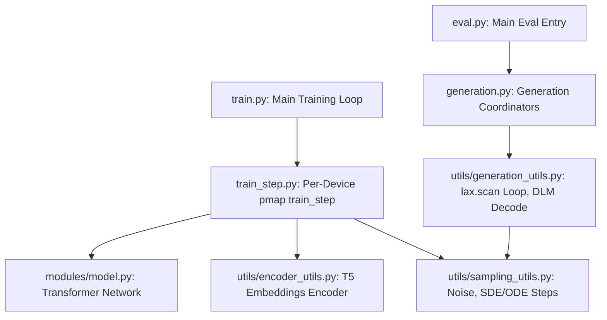
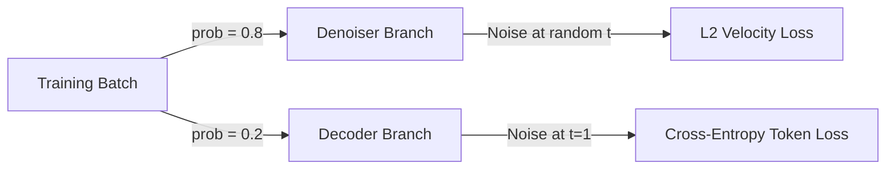

# ELF (Embedded Language Flows) Codebase Walkthrough & Duo Comparison

This document provides a detailed technical guide to the **ELF** codebase, highlighting its core architectural components, comparing its diffusion process with **Duo**, and specifically detailing the mathematical and programmatic implementation of the **unembedding layer** and token sampling.

---

## 1. Executive Summary & File Map of ELF

ELF (Embedded Language Flows) is a continuous-time continuous-space diffusion language model. Unlike discrete diffusion models, ELF performs the entire diffusion trajectory within the continuous embedding space of a pre-trained frozen text encoder (like T5) and projects to discrete tokens only at the final time step.



### Core File Walkthrough
* **train.py**: Initializes JAX/TPU configurations, loads pre-tokenized training datasets (e.g. OpenWebText) and the T5 encoder checkpoint, and coordinates training epochs.
* **train_step.py**: Performs the forward-noising, loss calculation, backpropagation, and EMA updates. It chooses between the *Denoiser* branch (L2 velocity loss) and the *Decoder* branch (cross-entropy classification loss) on each step.
* **generation.py**: Manages test generation loops for unconditional and conditional benchmarks, saving output `.jsonl` files and computing BLEU/ROUGE or GPT-2 Generative Perplexity.
* **modules/model.py**: Implements the **ELF Transformer** (featuring RoPE, RMSNorm, and SwiGLU feed-forward networks). It contains the **Factored Decoder Unembedding head** mapping model states to token probabilities.
* **utils/sampling_utils.py**: Implements noise injection ($z_t = t \cdot x_0 + (1-t) \cdot \epsilon$), Euler ODE integrations, SDE step equations, and self-conditioning guidance.
* **utils/generation_utils.py**: Coordinates JAX pmapped generation. It uses `jax.lax.scan` for fast looping and implements `_dlm_decode_batch` to perform argmax decoding at $t=1$.

---

## 2. Diffusion Comparison: ELF vs. Duo

The primary difference between ELF and Duo lies in the **space** in which the diffusion process occurs and **when** discretization (conversion to discrete tokens) is applied.

| Feature | ELF (Embedded Language Flows) | Duo (The Diffusion Duality) |
| :--- | :--- | :--- |
| **Diffusion Space** | **Continuous**: Trajectories move through embedding space $\mathbb{R}^{L \times d_{\text{model}}}$. | **Discrete**: Trajectories step through token indices $\{1, \dots, V\}^L$. |
| **Noising Process** | **Flow Matching**: Linear interpolation between clean embedding $x_0$ and continuous Gaussian noise $\epsilon \sim \mathcal{N}(0, \sigma_n^2 I)$. | **Uniform Jump (USDM)**: Categorical transition probability replacing tokens with uniform random indices. |
| **Duality Link** | None. Purely continuous diffusion with late discretization. | **Gaussian-Discrete Duality**: Continuous log-SNR $\gamma_t$ is mapped to discrete probability $\alpha_t^{\text{USDM}}$. |
| **Trajectory Path** | Completely continuous from $t=0$ to $t=1$. No discrete tokens are generated along the path. | Discrete at every step. Tokens are updated based on probability transitions at each step. |
| **Unembedding Execution** | Performed **once** at the final step $t=1$ to reconstruct tokens. | Evaluated at **every step** to predict token probabilities $p_{\theta}(x_0 \mid z_t)$. |

---

## 3. The Unembedding Layer in ELF

### 3.1 Mathematical Formulation
The continuous embedding sequence $x_0$ is generated by a frozen pre-trained text encoder (T5-Small, where $d_{\text{model}} = 512$). 

At the end of the reverse diffusion trajectory ($t=1$), the latent state $z_1 \approx x_0$ is passed through the model. The transformer layers extract a hidden sequence representation $h \in \mathbb{R}^{L \times d_{\text{hidden}}}$ (where $d_{\text{hidden}} = 768$ for ELF-B).

To map $h$ back to token logits over the vocabulary size $V$, ELF uses a **Factored Decoder Unembedding network** instead of a single projection matrix. This MLP projector consists of a down-projection to embedding dimension $d_{\text{model}}$ followed by a vocabulary projection:

$$\text{Proj}(h) = \text{GELU}(h \cdot W_{\text{proj}} + b_{\text{proj}}) \quad \in \mathbb{R}^{L \times d_{\text{model}}}$$
$$\text{DecoderLogits}(h) = \text{Proj}(h) \cdot W_{\text{unembed}} + b_{\text{unembed}} \quad \in \mathbb{R}^{L \times V}$$

where:
* $W_{\text{proj}} \in \mathbb{R}^{d_{\text{hidden}} \times d_{\text{model}}}$
* $W_{\text{unembed}} \in \mathbb{R}^{d_{\text{model}} \times V}$

### 3.2 Programmatic Implementation (Code)
In `modules/model.py`, this is implemented inside the `ELF` flax module:

```python
# Factored decoder unembedding: hidden -> text_encoder_dim -> vocab
decoder_logits = None
bn = self.text_encoder_dim  # e.g., 512 (T5 embedding dimension)
proj_kernel = self.param('proj_kernel', DEFAULT_KERNEL_INIT, (self.hidden_size, bn))
proj_bias = self.param('proj_bias', DEFAULT_BIAS_INIT, (bn,))
unembed_kernel = self.param('unembed_kernel', DEFAULT_KERNEL_INIT, (bn, self.vocab_size))
unembed_bias = self.param('unembed_bias', DEFAULT_BIAS_INIT, (self.vocab_size,))

if decoder_step_active is not None:
    decoder_logits = jax.lax.cond(
        decoder_step_active,
        # Factored MLP: Gelu projection down to embedding size, then matrix multiply to vocab
        lambda xi: jax.nn.gelu(xi @ proj_kernel + proj_bias) @ unembed_kernel + unembed_bias,
        lambda xi: jnp.zeros((*xi.shape[:2], self.vocab_size), dtype=xi.dtype),
        x,
    )
```

### 3.3 Training the Unembedding Layer
During training, the parameters of this unembedding layer ($W_{\text{proj}}$, $W_{\text{unembed}}$, etc.) must learn to map noisy latents back to exact discrete tokens. ELF achieves this by splitting each training batch into two pathways in `train_step.py`:



1. **Denoiser Branch (80% probability)**:
   - Evaluates the model at a random time $t \sim \text{LogitNormal}$.
   - Computes L2 loss between the predicted velocity $v_{\theta}$ and target velocity.
   - Sets `decoder_step_active = False` (the unembedding layer remains inactive and returns zeros).
2. **Decoder Branch (20% probability)**:
   - Evaluates the model at $t=1$.
   - The input embeddings $x_0$ are perturbed with high noise scale (representing the endpoint state).
   - Sets `decoder_step_active = True`.
   - Computes a standard **Cross-Entropy Loss** comparing the predicted `decoder_logits` against the ground-truth token IDs. This trains the projection and unembedding parameters to decode noisy continuous states into correct tokens.

---

## 4. Sampling from Continuous Embeddings to Tokens

At test time, sampling is performed using SDE or ODE integrators, ending with discrete token selection.

### 4.1 Step-by-Step Inference Process
1. **Initialize Noise**: Sample a sequence of random continuous vectors $z_0 \sim \mathcal{N}(0, \sigma_n^2 I)$ of shape `(batch, max_length, d_model)`.
2. **Solve Trajectory**: Integrate the velocity predictions $v_{\theta}$ from $t=0$ to $t=1$:
   - For ODE, Euler step updates: $z_{t+dt} = z_t + dt \cdot v_{\theta}(z_t, t)$.
   - For SDE, incorporates randomized Langevin-style correction steps.
3. **Generate Final Latent**: The integration yields $z_1 \approx x_0$, the predicted continuous embedding representation of the text.
4. **Trigger Unembedding**: Run a final forward pass with $z_1$ at $t=1.0$ and `decoder_step_active = True` to compute the classification logits over the vocabulary.
5. **Argmax Token Selection**: Convert logits to discrete token indices by taking the argmax at each sequence position:
   $$\hat{y}_i = \text{argmax}(\text{logits}_i)$$

### 4.2 Decoding Code Walkthrough
In `utils/generation_utils.py`, the token reconstruction is handled by `_dlm_decode_batch`:

```python
def _dlm_decode_batch(z, model_params, model_apply_fn, t_final_val, config, self_cond_cfg_scale):
    """Decode final continuous latent z -> token indices."""
    batch_size = z.shape[0]
    t_final = jnp.full((batch_size,), t_final_val, dtype=z.dtype) # t = 1.0
    
    # Prepend zero representation for self-conditioning input if enabled
    z_input = jnp.concatenate([z, jnp.zeros_like(z)], axis=-1) if config.self_cond_prob > 0 else z
    
    # Run forward pass with decoder_step_active=True
    _, decoder_logits = model_apply_fn(
        {"params": model_params}, z_input, t_final,
        deterministic=True,
        decoder_step_active=jnp.array(True),
    )
    
    # Retrieve argmax token indices
    return jnp.argmax(decoder_logits, axis=-1)
```

The resulting token indices are then decoded into human-readable text by the tokenizer (`tokenizer.decode(predicted_ids)`).
